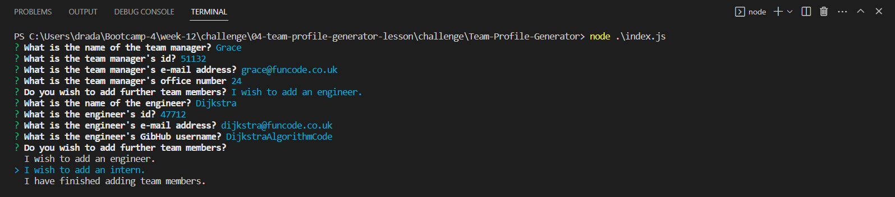

# Team Profile Generator (Week-12 Challenge)

## Description
The purpose of this project was to create a command line application, using Node.js, which would generate an html file with entries for the members of a software development team. These entries include each employee's name, id number, e-mail address and role. npm inquirer is employed to obtain this data from the user with standard input prompts; while a list query, paired with conditional code, allows the user to add as many additional employees as desired. Once employee data is obtained, objects are created for each employee using class templates. There is a parent "Employee" class along with three subclasses for managers, engineers and interns; each subclass holds additional information specific to each role. Once employee objects are created they are stored in an array. When no further employees need to be added, the array is passed through a render() function which places employee data into an html template using methods specific to the Employee class and its subclasses. The completed template is then written to a file called "team.html" using "fs.writeFile" and stored in the "output" folder. Using this code, development team webpages can be generated quickly and efficiently providing useful and easy-to-access employee information. The code for the Employee class and each of its subclasses was designed through a Test Driven Development (TDD) technique using Jest. Before this code could be implemented it needed to pass 17 different tests in 4 test suites (one suite for each class and subclass). 

## Table of Contents
- [Installation](#installation)
- [Usage](#usage)
- [Credits](#credits)
- [License](#license)
- [Tests](#tests)
- [Questions](#questions)

## Installation
To run the Team Profile Generator, this repo must first be cloned onto the user's machine with GitBash or a similar application. Installation may then be completed using VS Code. Once the relevant folder is opened in VS Code, right-click on "index.js" and select "Open in Integrated Terminal". Then type "npm install" at the prompt and hit Enter. Jest and inquirer will install automatically and the Team Profile Generator will be ready to use (and ready for testing).

## Usage
To use the Team Profile Generator right-click on "index.js" and select "Open in Integrated Terminal". Then type "node index.js" and answer the questions asked by "inquirer". Once these questions have been correctly answered the application will print "Success!" and a file called "team.html" will be generated in the "output" folder. This html can then be copied and deployed online. Upon download the Team Profile Generator contains a sample "team.html" file in the "output" folder; this, and any subsequent "team.html" file, will be overwritten when the user generates a new html file using the application.

The following image gives a screenshot of the questions put forward by "inquirer" at the command prompt, along with sample replies:

## Credits
N/A

## License
N/A

## Tests
The class templates contained in the files Employee.js, Engineer.js, Intern.js and Manager.js was written using the Test Driven Development (TDD) technique. To run these tests using npm Jest right click on "index.js" and select "Open in Integrated Terminal". Then type "npm test" at the command prompt. Four tests suites will run (one for each file) with a total of fourteen tests.

The following image gives a screenshot of the test results generated by npm Jest at the command prompt:

## Questions
If you have any questions regarding the repo, open an issue or contact me directly at dra21@cam.ac.uk.
You can find more of my work at [DavidBlueLamassu](https://github.com/DavidBlueLamassu).